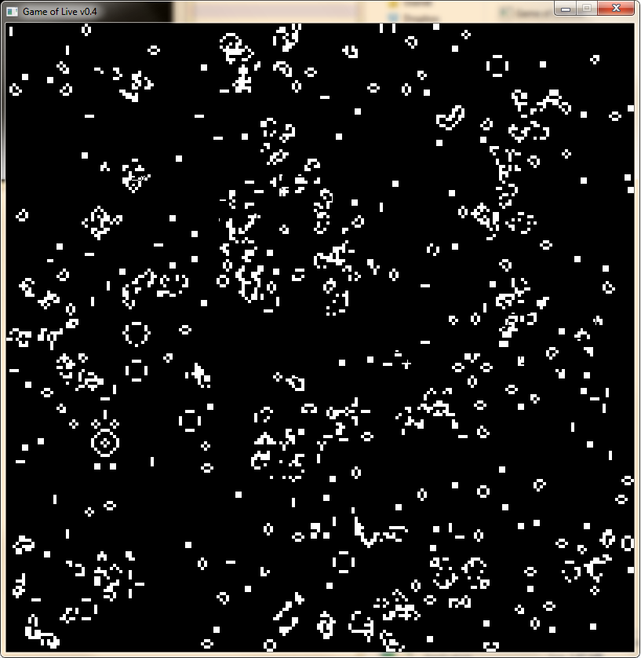

Conway's Game of Life
=====================

An implementation of Conway's Game of Life with SDL.

Building
========

The application is distributed as a Code::Blocks project. Build tested under mingw 4.7.0. It depends on SDL for graphical output.

Controls
========

The simulation can be paused at any time by pressing the spacebar. While paused, the simulation can be advanced one frame with the right arrow key. A new seeding of random cells can be added by pressing 'r'.
Living cells can be 'drawn' by pressing and holding left click.